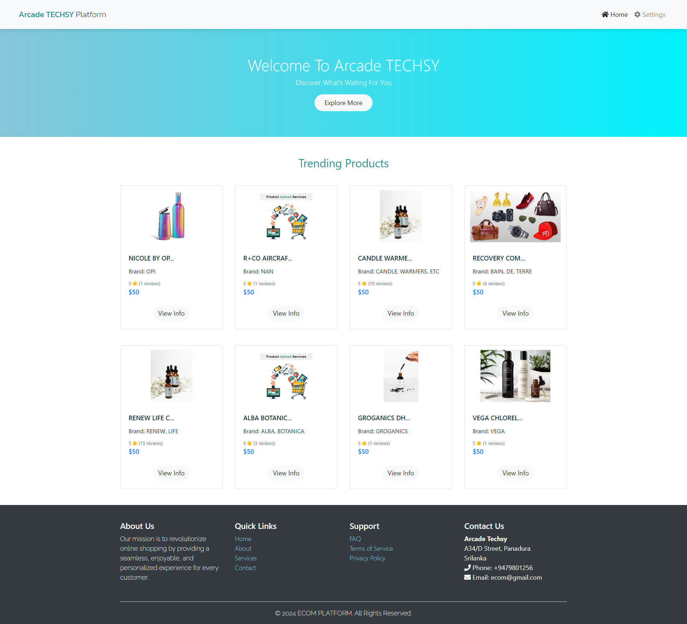
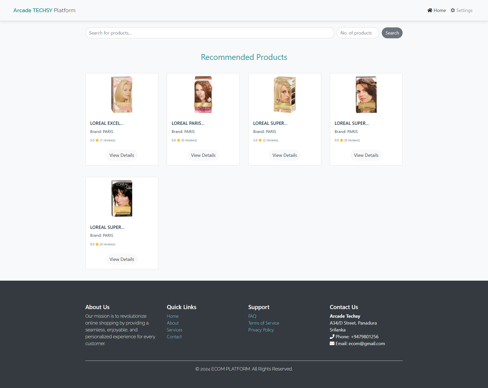
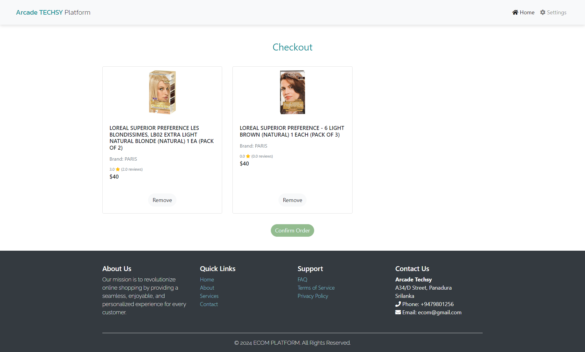
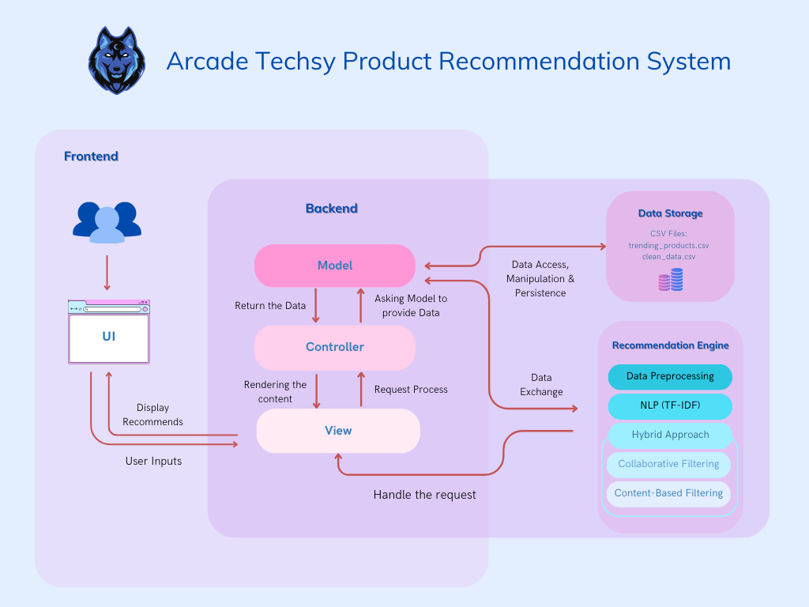

# Arcade Techsy

### An Innovative Product Recommendation System 🎮

Arcade Techsy is a content-based product recommendation system designed to enhance the online shopping experience. This project focuses on personalized product suggestions, using advanced filtering techniques. 🛒✨

 <!-- Optional: Add a visually appealing banner image -->

---
## Dependencies 📦

- **Flask** 🚀: `Flask==2.0.1`
- **Flask-Bootstrap** 🎨: `Flask-Bootstrap==3.3.7.1`
- **Flask-WTF** 📝: `Flask-WTF==0.14.3`
- **WTForms** 📃: `WTForms==2.3.3`
- **Jinja2** 🧩: `Jinja2==3.0.1`
- **pandas** 📊: `pandas==1.3.3`
- **NumPy** 🔢: `numpy==1.21.2`
---

## Key Features 🔑
- **Hybrid Recommendation Approach**: Primarily using content-based filtering with future plans for collaborative filtering.
- **TF-IDF and Cosine Similarity**: Transforming product attributes into numerical representations for precise recommendations.
- **Python Flask Backend**: A robust and efficient backend to process product data and user interactions.
- **SQLite Integration**: Lightweight database for managing product information.
- **Intuitive Frontend**: Built with HTML, CSS, and JavaScript, providing a seamless user experience.
- **Continuous Learning**: Capable of refining its recommendations based on user interactions and feedback.

---

## Screenshots 📸
 _*index.html*_
 <br> <br>


---

_*main.html_1*_
 <br> <br>


---

_*main.html_2*_
 <br> <br>


---

_*checkout.html_1*_
 <br> <br>


---

_*checkout.html_2*_
 <br> <br>


---

## Installation & Setup

To run the project locally:

1. **Clone the repository**:
   ```bash
   git clone https://github.com/Hansamalee0630/Product_Recommendation_System.git
   ```

2. **Navigate to the project directory**:
   ```bash
   cd Arcade_Techsy_Product_Recommendation_Sytem
   ```

3. **Install dependencies**:
   ```bash
   pip install -r requirements.txt
   ```

4. **Run the application**:
   ```bash
   python app.py
   ```

Open [http://localhost:5000](http://localhost:5000) in your browser to see the application in action.

---

## Project Architecture 🏗️

