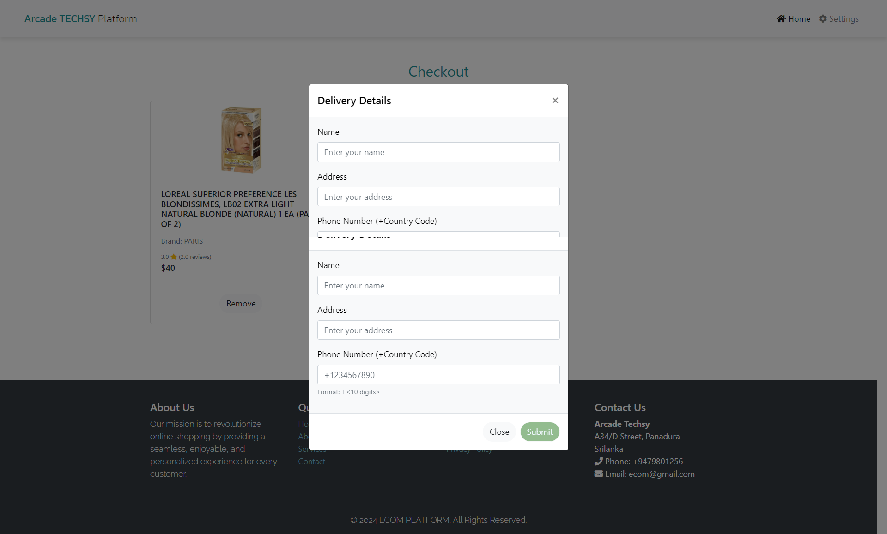

# Arcade Techsy

### An Innovative Product Recommendation System 🎮

Arcade Techsy is a content-based product recommendation system designed to enhance the online shopping experience. This project focuses on personalized product suggestions, using advanced filtering techniques. 🛒✨

 <!-- Optional: Add a visually appealing banner image -->

---
## Dependencies 📦

- **Flask** 🚀: `Flask==2.0.1`
- **Flask-Bootstrap** 🎨: `Flask-Bootstrap==3.3.7.1`
- **Flask-WTF** 📝: `Flask-WTF==0.14.3`
- **WTForms** 📃: `WTForms==2.3.3`
- **Jinja2** 🧩: `Jinja2==3.0.1`
- **pandas** 📊: `pandas==1.3.3`
- **NumPy** 🔢: `numpy==1.21.2`
---

## Key Features 🔑
- **Hybrid Recommendation Approach**: Primarily using content-based filtering with future plans for collaborative filtering.
- **TF-IDF and Cosine Similarity**: Transforming product attributes into numerical representations for precise recommendations.
- **Python Flask Backend**: A robust and efficient backend to process product data and user interactions.
- **SQLite Integration**: Lightweight database for managing product information.
- **Intuitive Frontend**: Built with HTML, CSS, and JavaScript, providing a seamless user experience.
- **Continuous Learning**: Capable of refining its recommendations based on user interactions and feedback.

---

## Screenshots 📸
 _*index.html*_
 <br> <br>


---

_*main.html_1*_
 <br> <br>


---

_*main.html_2*_
 <br> <br>


---

_*checkout.html_1*_
 <br> <br>


---

_*checkout.html_2*_
 <br> <br>


---

```
## Directory overview

Arcade_Techsy_Product_Recommendation_System/
│
├── product/                                 # Product file
│   ├── model/                               # Model for data handling
│   │   └── recommendations.py               # Recommendations code
│   ├── data/                                # Data files
│   │   ├── trending_products.csv            # Trending data file
│   │   ├── clean_data.csv                   # Cleaned data file
│   │   └── marketing_sample_5k_data.tsv     # Sample data file
│   ├── static/                              # Static files
│   │   ├── styles.css                       # Stylesheet for the application
│   │   ├── img/                             # Images used in the application
│   │   │   ├── img_1.png 
│   │   │   ├── img_2.png 
│   │   │   ├── img_3.png 
│   │   │   ├── img_4.png 
│   │   │   ├── img_5.png 
│   │   │   ├── img_6.png 
│   │   │   ├── img_7.png 
│   │   │   └── img_8.png 
│   └── templates/                           # Template files
│   │   ├── index.html                       # Home page
│   │   ├── main.html                        # Recommendation page
│   │   ├── checkout.html                    # Checkout page
│   │   ├── cart.html                        # Cart page
│   ├── app.py                               # Flask app
│   ├── products/                            # Database file
│   ├── create_db.py                         # Database creation script
│   └── README.md                            # Project documentation
├── products/                                # Database file
└── requirements.txt                         # Project dependencies

                   
```

## Installation & Setup

To run the project locally:

1. **Clone the repository**:
   ```bash
   git clone https://github.com/Hansamalee0630/Product_Recommendation_System.git
   ```

2. **Navigate to the project directory**:
   ```bash
   cd Arcade_Techsy_Product_Recommendation_Sytem
   ```

3. **Install dependencies**:
   ```bash
   pip install -r requirements.txt
   ```

4. **Run the Data base application**:
   ```bash
   python create_db.py
   ```
   
5. **Run the application**:
   ```bash
   python app.py
   ```

Open [http://localhost:5000](http://localhost:5000) in your browser to see the application in action.

---

## Project Architecture 🏗️

